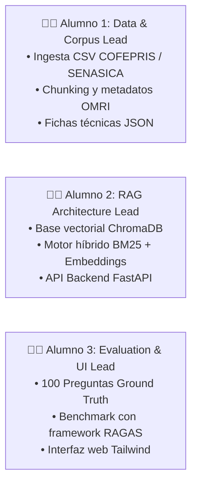
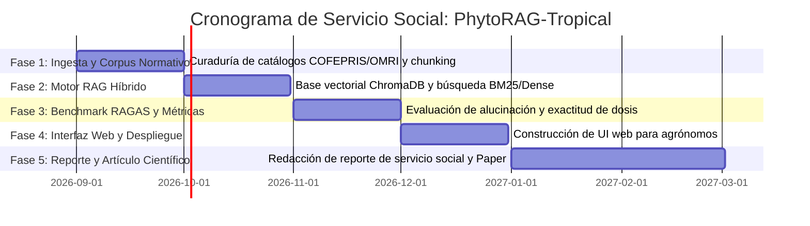

# 👩‍💻 Guía de Trabajo para Estudiantes de Servicio Social
### Proyecto: PhytoRAG-Tropical | Director: Dr. Carlos Flores

¡Bienvenidos a su proyecto de Servicio Social Constitucional en la Facultad de Telemática (Universidad de Colima)!

---

## 🎯 Su Misión en este Proyecto
Desarrollarán y evaluarán un **Consultor Agronómico con Inteligencia Artificial (RAG Híbrido)** capaz de responder consultas fitosanitarias complejas para cultivos frutales tropicales (Limón, Mango, Papaya) con **cero alucinaciones**, garantizando el cumplimiento estricto del Vademécum Oficial de Plaguicidas de México (COFEPRIS/SENASICA), normativas orgánicas (OMRI/LPO) y límites de exportación (USDA/LMR).

---

## 👥 Roles y Asignación de Tareas por Estudiante

Para trabajar con máxima agilidad y sin interferencias:



---

## 💻 Setup Inicial en su Computadora

1. **Clonar el repositorio:**
   ```bash
   git clone https://github.com/Proyectos-UCOL/phytorag-tropical.git
   cd phytorag-tropical
   ```
2. **Crear y activar el entorno virtual de Python:**
   ```bash
   python3 -m venv .venv
   source .venv/bin/activate    # En Windows: .venv\Scripts\activate
   ```
3. **Instalar dependencias oficiales:**
   ```bash
   pip install -r requirements.txt
   ```
4. **Configurar APIs de IA (Política de Modelos y Costos):**
   - Copien el archivo de ejemplo: `cp .env.example .env`
   - **Fase 1 (Gratuita — Sin Tarjeta):**
     - Generen su clave gratuita de **Google Gemini** en [Google AI Studio](https://aistudio.google.com/) y agréguenla como `GEMINI_API_KEY=AIzaSy...`.
   - **Fase 2 (Benchmark Multi-Modelo de Pago con OpenRouter):**
     - ⚠️ **No ingresen tarjetas personales:** Cuando llegue el momento de evaluar GPT-4o o Claude para el artículo científico, **soliciten la `OPENROUTER_API_KEY` directamente al Dr. Carlos Flores**, quien les asignará una clave institucional con saldo.
5. **Probar el servidor inicial:**
   ```bash
   python src/app.py
   ```

---

## 🗓️ Cronograma de Trabajo (480 Horas / 6 Meses)



---

## 🛠️ Cómo deben trabajar en el día a día

1. **Uso de Asistentes de IA (Permitido y Fomentado):**
   - Pueden utilizar asistentes de IA (Cursor, Claude, Gemini, ChatGPT) para programar y depurar. El archivo `AGENTS.md` guiará a sus asistentes automáticamente.
2. **Flujo en Git y Regla Anti-Colisiones (1 Alumno = 1 Rama):**
   - 🚫 **Prohibido hacer commits a `main`:**
   - Cada uno trabaja en su propia rama:
     - Alumno 1: `git checkout -b feature/issue-01-ingesta-corpus`
     - Alumno 2: `git checkout -b feature/issue-02-motor-rag`
     - Alumno 3: `git checkout -b feature/issue-03-benchmark-ragas`
   - Al terminar, abren un **Pull Request (PR)** en GitHub asignando al Dr. Carlos Flores (`@cfcortesmx`) como revisor.
3. **Reuniones de Avance:**
   - Una reunión quincenal de 30 minutos para revisar métricas, avances y resolver dudas.
