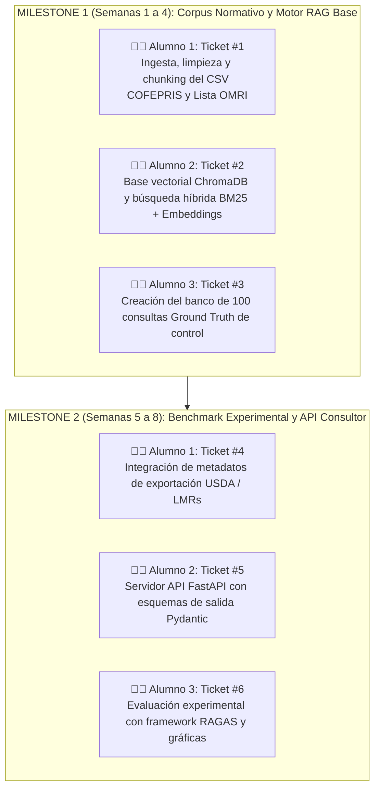

# 🛡️ Workflow, Guardrails y Metodología de Trabajo: PhytoRAG-Tropical
### Proyecto: PhytoRAG-Tropical | Director: Dr. Carlos Flores

Este documento define las reglas de ingeniería de software, control de versiones (Git), coordinación de equipo y calidad técnica obligatorias para los 3 estudiantes.

---

## 🚫 1. Las 5 Reglas de Oro (Guardrails Innegociables)

1. **`main` es Sagrada (PROHIBIDO PUSH DIRECTO):**
   - Ningún estudiante puede subir código directamente a `main`. Todo cambio se integra mediante **Pull Request (PR)**.
2. **Regla Anti-Colisiones (1 Ticket = 1 Alumno = 1 Rama):**
   - Cada estudiante crea una rama de trabajo independiente partiendo de `main` con la nomenclatura:
     `feature/issue-<NUMERO>-<nombre-corto>`
     * Alumno 1: `feature/issue-01-ingesta-senasica`
     * Alumno 2: `feature/issue-02-motor-rag-chroma`
     * Alumno 3: `feature/issue-03-benchmark-ragas`
3. **Revisión y Aprobación Obligatoria:**
   - Al terminar la tarea, el alumno abre el **Pull Request (PR)** en GitHub y asigna al Dr. Carlos Flores (`@cfcortesmx`) como revisor. El merge solo se realiza con su aprobación.
4. **Calidad de Código y Tipado Obligatorio:**
   - En Python: Tipado estricto con `Pydantic` para todas las entidades y funciones RAG.
   - Formato automático con `ruff format .` y cero errores de linter con `ruff check .`.
5. **Cero Alucinaciones en Dosificación:**
   - Toda recomendación de dosis o plaguicida debe originarse obligatoriamente de un fragmento documental recuperado por el RAG. Queda prohibido generar valores numéricos inventados.

---

## 🗺️ 2. Los Primeros 2 Milestones (M1 y M2)



---

## 🛠️ 3. Comandos de Git para el Día a Día

```bash
# 1. Actualizar tu rama main local
git checkout main
git pull origin main

# 2. Crear tu rama de trabajo
git checkout -b feature/issue-01-tu-tarea

# 3. Guardar cambios y subir a GitHub
git add .
git commit -m "feat: implementar parser de fichas COFEPRIS"
git push origin feature/issue-01-tu-tarea

# 4. Abrir Pull Request en la interfaz web de GitHub y asignar al Dr. Carlos Flores
```
